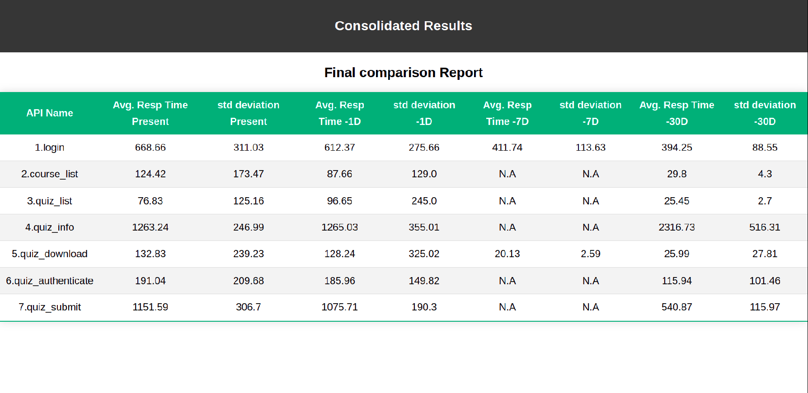

# api_perf_check
## Description
* Modern web apps are composed of a frontend and a backend
* The backend often exposes API endpoints to the browser/mobile clients
* With changes in the code/state of the application the performance of these APIs might be affected
* our tool allows us to track the performance change in theses apis
* highlights those APIs whose performance have changed significantly
* the tool itself is composed of two components the client_end_script and server_end_script
* To know more about api_perf_check refer this [link](resources/api_perf_check.pptx) 

## Initial Setup
The initial setup is described using SAFE as an example, you need to configure it as per your use case.
### Configuring hosts and ports

* the config.py file in client_end_script
```
TEST_SERVER_HOST="https://safev2.cse.iitb.ac.in/" # host which will point to the backend app 
LOG_HOST="10.129.7.11" # host where logs will be collected
CPU_HOST ="10.129.7.11" # host where the application is running

COMPARE_WITH_PREV_ENTRIES = (1,7,30) # this mentions the previous entries with which API performance is compared

# the below ones should only be configured in case ports are not available
# match with the config.py file in server_end_script
SERVER_DAEMON_PORT=5000
FTP_SERVER_PORT=5001
HTTP_PORT=5002 
RESULT_PORT = 5500
# this should be configured in case more log lines need to searched for each component
SEARCH_LINES_LIMIT=200000
```

* the config.py file in server_end_script
```
# same as client_end_script
SERVER_DAEMON_PORT=5000
FTP_SERVER_PORT=5001
HTTP_PORT=5002
```

### components.json
* this component could be any component where response time for test are stored. e.g nginx,django,etc
* only one such component is enough
* the components.json file will be used by both the client_end_script and server_end_script
* e.g. of the components.json is shown below
```
[
    {
        "componentName":"outer-nginx",
        "logPath":"/var/log/nginx/safev2.cse-proxy-access.log",
        "timeUnit":"s"
    }
]
```

### Logs
* turn on the logs for the component mentioned in components.json
* make sure the response time should be like \*\*\*<response_time>\*\*\* in logs
* e.g. logs shown below
```
[24/Jul/2023:13:52:10 +0530] GET /sys_perf_check/0a0f8d235d819a03/20/ HTTP/1.0***0.024***
```

### perfcheck.py
* a script written in locust to generate load on the APIs that need to be monitored.
* you can refer the example in [link](client_end_script/perfcheck.py), it is for SAFE application and involves quiz taking sequential APIs
* you can also link other files in this perfcheck.py as per your need if your performance tests require them.For example in SAFE we require CourseCode.py, credentials.py, TestName.py 

### initial_script.py
* This script should contain steps that will do the initial setup before starting the actual performance test
* In our case we need to login as instructor, publish and start the quiz before doing the actual test
* Refer the [link](client_end_script/initial_script.py) for more details
* This script will be triggered before each performance test like a constructor

### APIs.json
* This file will contain the APIs that need to be monitored
* It will also contain the search term for each component
* e.g. shown below, whole file can be seen in [link](client_end_script/APIs.json)
```
[
    {
        "APIName":"1.login",
        "searchTerm":"\/api\/account\/login"
    },
    {
        "APIName":"2.course_list",
        "searchTerm":"\/api\/course"
    }
]
```


## Running the tool
### Start the server_end_script
* install twisted module (using pip)

```
# requires a components.json file
# run the below script on the server where you are hosting your project and want to measure its performance
$ python3 server_end_script.py
```

### Running the cliend_end_script
* install docker if not present
#### Build the docker container
```
$ docker build -t <image_name>
```

#### Run the script using the docker container
```
$ docker run --rm -p <result_port>:5500 -v $(pwd):/app <container_name> python3 client_end_script.py -l <user load> -t <duration>
```

### Results
* results indicating changes in API performance will be visible at the console


* Also, they will be available at <result_port> and can be seen in the browser
